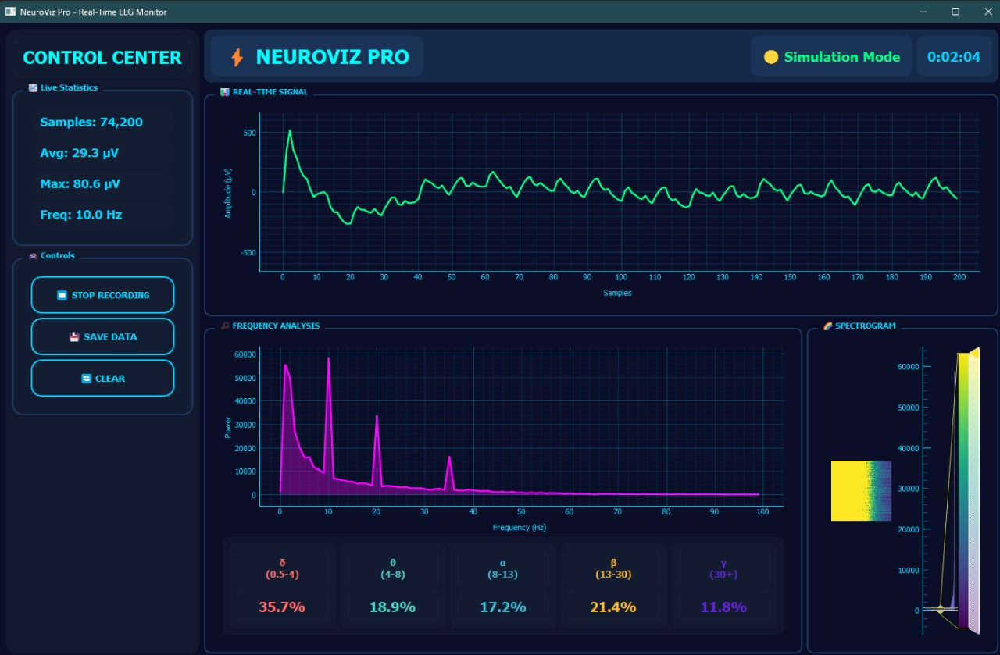

# NeuroViz Pro - Real-Time EEG Monitor 🧠⚡

[](https://www.python.org/)
[](https://pypi.org/project/PyQt5/)
[](LICENSE)
[]()

<div align="center">
  
  <p><i>Real-time EEG monitoring and brain wave analysis system</i></p>
</div>

## 📋 Table of Contents

- [Overview](#overview)
- [Features](#features)
- [System Architecture](#system-architecture)
- [Installation](#installation)
- [Configuration](#configuration)
- [Usage](#usage)
- [Operation Modes](#operation-modes)
- [Technical Details](#technical-details)
- [Project Structure](#project-structure)
- [Demo](#demo)
- [Troubleshooting](#troubleshooting)
- [Contributing](#contributing)
- [License](#license)
- [References](#references)

## 🎯 Overview

**NeuroViz Pro** is a comprehensive real-time EEG (Electroencephalography) monitoring and visualization system designed for neuroscience research, education, and biomedical applications. The system provides professional-grade signal processing, frequency analysis, and brain wave classification with an intuitive graphical interface.

### Key Capabilities

- **Real-time signal acquisition** from Arduino-based EEG hardware or simulation mode
- **Advanced DSP filtering** with configurable bandpass filters (1-50 Hz)
- **Multi-domain visualization**: Time series, FFT spectrum, and spectrograms
- **Brain wave classification**: Delta (δ), Theta (θ), Alpha (α), Beta (β), Gamma (γ)
- **Data recording and export** to CSV format for further analysis
- **Professional dark-themed UI** optimized for extended monitoring sessions

### Scientific Background

EEG measures electrical activity in the brain through electrodes placed on the scalp. Different frequency bands correspond to distinct brain states:

| Band | Frequency | Associated State |
|------|-----------|------------------|
| **Delta (δ)** | 0.5-4 Hz | Deep sleep, unconsciousness |
| **Theta (θ)** | 4-8 Hz | Drowsiness, meditation, creativity |
| **Alpha (α)** | 8-13 Hz | Relaxed awareness, closed eyes |
| **Beta (β)** | 13-30 Hz | Active thinking, concentration |
| **Gamma (γ)** | 30-50 Hz | Higher cognitive functions |

## ✨ Features

### 🔬 Signal Processing
- **Butterworth bandpass filter** (4th order, 1-50 Hz)
- Real-time filtering at 1000 Hz sampling rate
- Adaptive noise reduction and artifact rejection
- Configurable filter parameters for different applications

### 📊 Visualization Suite
- **Time-domain plot**: Rolling 2-second window with filtered signal
- **Frequency spectrum**: Real-time FFT analysis (0-100 Hz)
- **Spectrogram**: Time-frequency representation with color mapping
- **Band power indicators**: Live percentage distribution across brain wave bands

### 📈 Analytics Dashboard
- Live statistics (sample count, average amplitude, peak values)
- Dominant frequency detection and tracking
- Session timer and status monitoring
- Performance-optimized display (50ms update interval)

### 💾 Data Management
- Start/stop recording with single button
- Export to CSV with timestamps
- Automatic filename generation with date/time
- Buffer management and clearing

### 🎨 User Interface
- Modern dark theme optimized for low-light environments
- Responsive layout with professional aesthetics
- Color-coded band indicators with Greek symbols
- Status indicators for connection and operation mode

## 🏗️ System Architecture

```
┌─────────────────────────────────────────────────────────────────┐
│                        NEUROVIZ PRO SYSTEM                       │
└─────────────────────────────────────────────────────────────────┘
                                │
                ┌───────────────┴───────────────┐
                │                               │
        ┌───────▼────────┐             ┌────────▼────────┐
        │  ARDUINO MODE  │             │ SIMULATION MODE │
        │  (Hardware)    │             │   (Software)    │
        └───────┬────────┘             └────────┬────────┘
                │                               │
                └───────────────┬───────────────┘
                                │
                    ┌───────────▼───────────┐
                    │   SERIAL INTERFACE    │
                    │   (9600 baud / USB)   │
                    └───────────┬───────────┘
                                │
                    ┌───────────▼───────────┐
                    │  DATA ACQUISITION     │
                    │  • Sampling: 1000 Hz  │
                    │  • Buffer: 2000 pts   │
                    └───────────┬───────────┘
                                │
                    ┌───────────▼───────────┐
                    │ SIGNAL PROCESSING     │
                    │ • Bandpass Filter     │
                    │ • 1-50 Hz (4th order) │
                    └───────────┬───────────┘
                                │
                ┌───────────────┼───────────────┐
                │               │               │
        ┌───────▼──────┐  ┌────▼─────┐  ┌─────▼──────┐
        │ TIME DOMAIN  │  │   FFT    │  │SPECTROGRAM │
        │   DISPLAY    │  │ ANALYSIS │  │  DISPLAY   │
        └──────────────┘  └──────────┘  └────────────┘
                                │
                ┌───────────────┼───────────────┐
                │               │               │
        ┌───────▼──────┐  ┌────▼──────┐  ┌────▼──────┐
        │ BAND POWER   │  │STATISTICS │  │RECORDING  │
        │  ANALYSIS    │  │ DASHBOARD │  │  ENGINE   │
        └──────────────┘  └───────────┘  └───────────┘
                                │
                        ┌───────▼────────┐
                        │  CSV EXPORT    │
                        │  (Data Logs)   │
                        └────────────────┘
```

## 📦 Installation

### Prerequisites

- **Python**: Version 3.8 or higher
- **Operating System**: Windows, macOS, or Linux
- **Arduino** (optional): For hardware EEG acquisition

### Step 1: Clone the Repository

```bash
git clone https://github.com/MMansy19/NeuroViz-Pro-EEG-Monitor.git
cd NeuroViz-Pro-EEG-Monitor
```

### Step 2: Create Virtual Environment (Recommended)

```bash
# Windows
python -m venv venv
venv\Scripts\activate

# macOS/Linux
python3 -m venv venv
source venv/bin/activate
```

### Step 3: Install Dependencies

```bash
pip install -r requirements.txt
```

### Step 4: Verify Installation

```bash
python --version
pip list
```

## ⚙️ Configuration

### Primary Configuration (codeV1.py / codeV2.py)

Edit the **USER SETTINGS** section at the top of the file:

```python
# -----------------------------
# USER SETTINGS
# -----------------------------
USE_ARDUINO = False     # Toggle between Arduino and Simulation mode
SERIAL_PORT = "COM3"    # Your Arduino serial port (Windows: COMx, Linux: /dev/ttyUSBx)
BAUD_RATE = 9600        # Serial communication speed
SAMPLE_RATE = 1000      # Sampling frequency in Hz
BUFFER_SIZE = 2000      # Number of samples in rolling window
UPDATE_INTERVAL = 50    # GUI update interval in milliseconds
DECIMATION = 10         # Display decimation factor for performance

# Filter Configuration
LOWCUT = 1              # High-pass cutoff frequency (Hz)
HIGHCUT = 50            # Low-pass cutoff frequency (Hz)
FILTER_ORDER = 4        # Butterworth filter order
```

### Finding Your Serial Port

#### Windows
```powershell
# Open Device Manager → Ports (COM & LPT)
# Look for "Arduino Uno (COMx)"
```

#### macOS
```bash
ls /dev/tty.*
# Look for /dev/tty.usbmodem* or /dev/tty.usbserial*
```

#### Linux
```bash
ls /dev/ttyUSB* /dev/ttyACM*
# Grant permissions if needed:
sudo chmod 666 /dev/ttyUSB0
```

## 🚀 Usage

### Quick Start

#### 1. Simulation Mode (No Hardware Required)

```bash
python codeV1.py
```

This launches the application in **simulation mode** with synthetic brain wave signals.

#### 2. Arduino Mode (Hardware Connected)

```bash
python codeV2.py
```

Ensure Arduino is connected and `USE_ARDUINO = True` in the configuration.

### Interface Controls

| Button | Function | Shortcut |
|--------|----------|----------|
| **START RECORDING** | Begin data capture | - |
| **STOP RECORDING** | End recording session | - |
| **SAVE DATA** | Export recorded data to CSV | - |
| **CLEAR** | Reset buffers and displays | - |

### Workflow Example

1. **Launch Application**: Run the appropriate Python file
2. **Verify Connection**: Check status indicator (green = Arduino, yellow = Simulation)
3. **Start Recording**: Click "START RECORDING" button
4. **Monitor Signals**: Observe time-domain, FFT, and spectrogram displays
5. **Analyze Bands**: Check brain wave distribution percentages
6. **Stop Recording**: Click "STOP RECORDING"
7. **Save Data**: Click "SAVE DATA" and choose filename
8. **Export**: Data saved as `eeg_YYYYMMDD_HHMMSS.csv`

## 🔄 Operation Modes

### Mode 1: Arduino Hardware Mode

**Configuration:**
```python
USE_ARDUINO = True
SERIAL_PORT = "COM3"  # Adjust for your system
```

**Requirements:**
- Arduino board (Uno, Nano, Mega) with EEG sensor
- USB connection to computer
- Serial communication at 9600 baud

**Data Flow:**
```
Arduino Sensor → Serial USB → Python Script → Signal Processing → Visualization
```

**Advantages:**
- Real physiological data
- Live subject monitoring
- Research-grade acquisition

**Use Cases:**
- Clinical EEG studies
- Neurofeedback training
- Brain-computer interface (BCI) development

### Mode 2: Simulation Mode

**Configuration:**
```python
USE_ARDUINO = False
```

**Requirements:**
- None (software only)

**Data Flow:**
```
Synthetic Generator → Signal Processing → Visualization
```

**Simulation Model:**
```python
# Multi-frequency brain wave synthesis
t = sample_number / SAMPLE_RATE
delta = 20 * sin(2π * 2 * t)     # 2 Hz
theta = 25 * sin(2π * 6 * t)     # 6 Hz
alpha = 50 * sin(2π * 10 * t)    # 10 Hz
beta = 30 * sin(2π * 20 * t)     # 20 Hz
gamma = 15 * sin(2π * 35 * t)    # 35 Hz
noise = N(0, 8)                   # Gaussian noise
signal = 512 + Σ(all_bands) + noise
```

**Advantages:**
- No hardware required
- Controlled test signals
- Educational demonstrations
- Algorithm development

**Use Cases:**
- Software testing and debugging
- Student training
- Algorithm validation
- Demo presentations

### Mode Comparison

| Feature | Arduino Mode | Simulation Mode |
|---------|--------------|-----------------|
| **Hardware** | Required | Not required |
| **Data Source** | Real EEG signals | Synthetic waves |
| **Latency** | ~10-50ms | <1ms |
| **Signal Quality** | Subject to noise | Controllable |
| **Best For** | Research, Clinical | Education, Testing |

## 🔧 Technical Details

### Signal Processing Pipeline

#### 1. Data Acquisition
```python
# Arduino Mode: Read serial data
raw = serial.readline().decode().strip()
value = int(raw)

# Simulation Mode: Generate synthetic signal
value = 512 + delta + theta + alpha + beta + gamma + noise
```

#### 2. Buffering
```python
# Rolling buffer (2000 samples = 2 seconds at 1000 Hz)
data_buffer[:-1] = data_buffer[1:]
data_buffer[-1] = new_value
```

#### 3. Bandpass Filtering
```python
# Butterworth bandpass (1-50 Hz, 4th order)
b, a = butter(4, [1/500, 50/500], btype='band')
filtered = lfilter(b, a, data_buffer)
```

#### 4. Frequency Analysis
```python
# FFT computation
freqs = np.fft.rfftfreq(BUFFER_SIZE, d=1/SAMPLE_RATE)
fft_vals = np.abs(np.fft.rfft(filtered))

# Dominant frequency
dom_idx = np.argmax(fft_vals[1:100])
dominant_freq = freqs[dom_idx]
```

#### 5. Band Power Calculation
```python
# Extract power in each band
bands = {'delta': (0.5, 4), 'theta': (4, 8), 'alpha': (8, 13),
         'beta': (13, 30), 'gamma': (30, 50)}

for band, (low, high) in bands.items():
    mask = (freqs >= low) & (freqs <= high)
    band_power = np.sum(fft_vals[mask])
    percentage = (band_power / total_power) * 100
```

### Performance Optimization

1. **Update Decimation**: Display every Nth sample (N=10) for smooth rendering
2. **Selective Updates**: FFT every 2 cycles, spectrogram every 3 cycles
3. **Batch Processing**: Process 50 samples per update interval
4. **Frequency Limiting**: Display 0-100 Hz only (not full Nyquist range)
5. **Cached Statistics**: Store intermediate calculations

### Hardware Requirements

#### Minimum Specifications
- **CPU**: Dual-core 2.0 GHz
- **RAM**: 4 GB
- **Display**: 1280×720 resolution
- **USB**: USB 2.0 port (for Arduino)

#### Recommended Specifications
- **CPU**: Quad-core 2.5 GHz or higher
- **RAM**: 8 GB or more
- **Display**: 1920×1080 resolution
- **USB**: USB 3.0 port
- **GPU**: Dedicated graphics for smoother rendering

### Data Format

#### CSV Export Structure
```csv
Sample,Value
1,512.34
2,515.67
3,510.23
...
```

- **Column 1**: Sequential sample number
- **Column 2**: Raw EEG value (0-1023 for Arduino, simulated range)
- **Encoding**: UTF-8
- **Delimiter**: Comma

## 📁 Project Structure

```
NeuroViz-Pro-EEG-Monitor/
├── README.md                    # This file
├── DOCUMENTATION.md             # Detailed technical documentation
├── WORKFLOW.md                  # Step-by-step workflow guide
├── requirements.txt             # Python dependencies
├── LICENSE                      # MIT License
│
├── codeV1.py                    # Simulation mode version
├── codeV2.py                    # Arduino mode version
│
├── docs/                        # Additional documentation
│   ├── INSTALLATION.md          # Installation guide
│   ├── CONFIGURATION.md         # Configuration reference
│   ├── API_REFERENCE.md         # Code API documentation
│   └── TROUBLESHOOTING.md       # Common issues and solutions
│
├── assets/                      # Media files
│   ├── screenshoot.jpg          # Interface screenshot
│   ├── vidoeSimulation.mp4      # Demo video
│   └── flowchart.png            # System flowchart
│
├── examples/                    # Example scripts
│   ├── simple_acquisition.py   # Minimal acquisition example
│   └── custom_filter.py        # Custom filter example
│
└── tests/                       # Unit tests
    ├── test_filtering.py        # Filter tests
    └── test_fft.py              # FFT tests
```

## 🎬 Demo

### Screenshots

#### Main Interface


### Video Demo

[](vidoeSimulation.mp4)

**Demo Video**: `vidoeSimulation.mp4` - Complete walkthrough of features and operation modes.

### Live Features Demo

1. **Time-Domain Display**: Real-time filtered EEG signal
2. **FFT Spectrum**: Frequency components (0-100 Hz)
3. **Spectrogram**: Time-frequency heatmap
4. **Band Powers**: Delta, Theta, Alpha, Beta, Gamma percentages
5. **Statistics**: Live metrics dashboard
6. **Recording**: Start, stop, and export functionality

## 🛠️ Troubleshooting

### Common Issues

#### Issue 1: Arduino Not Detected

**Symptoms:**
- "Could not connect to COMx" message
- Falls back to simulation mode

**Solutions:**
1. Check USB cable connection
2. Verify correct COM port in Device Manager
3. Ensure Arduino drivers installed
4. Try different USB port
5. Check `SERIAL_PORT` setting in code

#### Issue 2: Import Errors

**Symptoms:**
```
ModuleNotFoundError: No module named 'pyqtgraph'
```

**Solution:**
```bash
pip install --upgrade pip
pip install -r requirements.txt
```

#### Issue 3: Slow Performance

**Symptoms:**
- Laggy interface
- Choppy plots

**Solutions:**
1. Increase `UPDATE_INTERVAL` (e.g., 100ms)
2. Increase `DECIMATION` factor (e.g., 20)
3. Reduce `BUFFER_SIZE` (e.g., 1000)
4. Close other applications
5. Use hardware acceleration

#### Issue 4: Serial Port Permission Denied (Linux)

**Solution:**
```bash
sudo usermod -a -G dialout $USER
# Logout and login, or:
sudo chmod 666 /dev/ttyUSB0
```

### Debug Mode

Enable detailed logging:
```python
import logging
logging.basicConfig(level=logging.DEBUG)
```

## 🤝 Contributing

We welcome contributions! Please follow these guidelines:

### How to Contribute

1. **Fork** the repository
2. **Create** a feature branch (`git checkout -b feature/AmazingFeature`)
3. **Commit** your changes (`git commit -m 'Add AmazingFeature'`)
4. **Push** to the branch (`git push origin feature/AmazingFeature`)
5. **Open** a Pull Request

### Contribution Areas

- 🐛 Bug fixes
- ✨ New features
- 📝 Documentation improvements
- 🧪 Test coverage
- 🎨 UI/UX enhancements
- 🌐 Internationalization

### Code Style

- Follow PEP 8 guidelines
- Add docstrings to functions
- Include type hints where applicable
- Write unit tests for new features

## 📄 License

This project is licensed under the **MIT License** - see the [LICENSE](LICENSE) file for details.

```
MIT License

Copyright (c) 2025 NeuroViz Pro Team

Permission is hereby granted, free of charge, to any person obtaining a copy
of this software and associated documentation files (the "Software"), to deal
in the Software without restriction...
```

## 📚 References

### Academic Resources

1. **EEG Fundamentals**
   - Niedermeyer, E., & da Silva, F. L. (2005). *Electroencephalography: Basic Principles, Clinical Applications, and Related Fields*. Lippincott Williams & Wilkins.

2. **Signal Processing**
   - Cohen, M. X. (2014). *Analyzing Neural Time Series Data: Theory and Practice*. MIT Press.

3. **Brain Wave Bands**
   - Sanei, S., & Chambers, J. A. (2013). *EEG Signal Processing*. John Wiley & Sons.

### Technical Documentation

- [PyQt5 Documentation](https://www.riverbankcomputing.com/static/Docs/PyQt5/)
- [PyQtGraph Documentation](http://www.pyqtgraph.org/documentation/)
- [SciPy Signal Processing](https://docs.scipy.org/doc/scipy/reference/signal.html)
- [NumPy FFT](https://numpy.org/doc/stable/reference/routines.fft.html)

### Related Projects

- [OpenBCI](https://openbci.com/) - Open-source brain-computer interface
- [MNE-Python](https://mne.tools/) - MEG and EEG data analysis
- [EEGLAB](https://sccn.ucsd.edu/eeglab/) - MATLAB toolbox for EEG analysis

## 👥 Authors & Acknowledgments

**NeuroViz Pro Team**
- Neuroengineering Course - Fall 2025
- Faculty of Engineering, Cairo University

### Contact

- **Repository**: [https://github.com/MMansy19/NeuroViz-Pro-EEG-Monitor](https://github.com/MMansy19/NeuroViz-Pro-EEG-Monitor)
- **Issues**: [GitHub Issues](https://github.com/MMansy19/NeuroViz-Pro-EEG-Monitor/issues)
- **Discussions**: [GitHub Discussions](https://github.com/MMansy19/NeuroViz-Pro-EEG-Monitor/discussions)

---

<div align="center">
  <p><b>Made with ❤️ for Neuroscience</b></p>
  <p>⭐ Star this repository if you find it helpful!</p>
</div>
