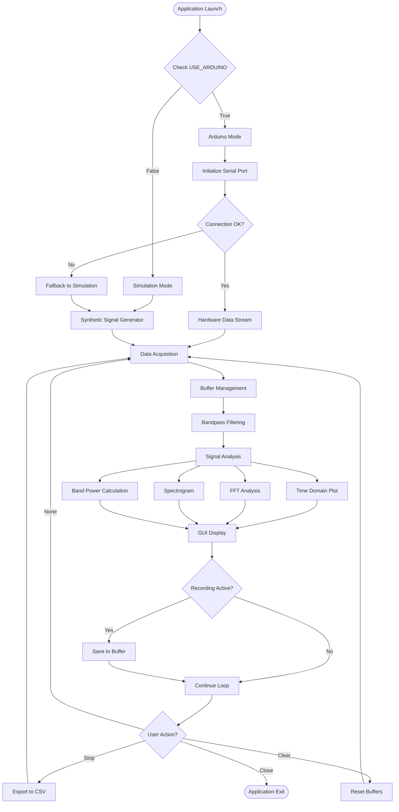

# NeuroViz Pro - Detailed Workflow Guide 🔄

## Table of Contents
1. [System Workflow Overview](#system-workflow-overview)
2. [Mode Selection Workflow](#mode-selection-workflow)
3. [Data Acquisition Pipeline](#data-acquisition-pipeline)
4. [Signal Processing Workflow](#signal-processing-workflow)
5. [Visualization Pipeline](#visualization-pipeline)
6. [Recording Workflow](#recording-workflow)
7. [User Interaction Flow](#user-interaction-flow)

---

## 1. System Workflow Overview



---

## 2. Mode Selection Workflow

### Step-by-Step Mode Selection Process

```
┌─────────────────────────────────────────────────────┐
│         APPLICATION INITIALIZATION                   │
└─────────────────────────────────────────────────────┘
                       │
                       ▼
         ┌─────────────────────────────┐
         │  Read Configuration         │
         │  USE_ARDUINO = ?            │
         └─────────────────────────────┘
                       │
            ┌──────────┴──────────┐
            │                     │
       ┌────▼─────┐         ┌─────▼────┐
       │  FALSE   │         │   TRUE   │
       └────┬─────┘         └─────┬────┘
            │                     │
   ┌────────▼────────┐   ┌────────▼────────────┐
   │ SIMULATION MODE │   │   ARDUINO MODE      │
   │                 │   │                     │
   │ • No hardware   │   │ • Open serial port  │
   │ • Synthetic     │   │ • SERIAL_PORT       │
   │   wave gen      │   │ • BAUD_RATE: 9600   │
   │ • Immediate     │   │                     │
   │   start         │   └─────────┬───────────┘
   └────────┬────────┘             │
            │              ┌────────▼────────┐
            │              │ Serial Connect? │
            │              └────────┬────────┘
            │                 ┌─────┴─────┐
            │                 │           │
            │            ┌────▼───┐  ┌────▼────┐
            │            │  YES   │  │   NO    │
            │            └────┬───┘  └────┬────┘
            │                 │           │
            │          ┌──────▼─────┐     │
            │          │ HARDWARE   │     │
            │          │ DATA READY │     │
            │          └──────┬─────┘     │
            │                 │           │
            │                 │    ┌──────▼──────┐
            │                 │    │  FALLBACK   │
            │                 │    │ TO SIMULATION│
            │                 │    └──────┬──────┘
            │                 │           │
            └─────────────────┴───────────┘
                              │
                    ┌─────────▼──────────┐
                    │ START MAIN LOOP    │
                    │ • Data acquisition │
                    │ • Signal process   │
                    │ • Visualization    │
                    └────────────────────┘
```

### Configuration Code Flow

```python
# Step 1: Application starts
app = QtWidgets.QApplication(sys.argv)
window = EEG_GUI()

# Step 2: In __init__ method
def __init__(self):
    super().__init__()
    
    # Step 3: Check USE_ARDUINO flag
    if USE_ARDUINO:
        # Step 4a: Try Arduino connection
        try:
            self.ser = serial.Serial(SERIAL_PORT, BAUD_RATE)
            self.use_simulation = False
            print("✓ Connected to Arduino")
        except:
            # Step 4b: Fallback to simulation
            print("⚠ Could not connect, using simulation")
            self.use_simulation = True
            self.ser = None
    else:
        # Step 4c: Direct simulation mode
        print("ℹ Simulation mode selected")
        self.use_simulation = True
        self.ser = None
    
    # Step 5: Initialize GUI
    self.init_ui()
    
    # Step 6: Start update timer
    self.timer = QtCore.QTimer()
    self.timer.timeout.connect(self.update)
    self.timer.start(UPDATE_INTERVAL)
```

---

## 3. Data Acquisition Pipeline

### Detailed Acquisition Flow

```
TIME: t=0ms                                     t=50ms
  │                                                │
  ▼                                                ▼
┌─────────────────────────────────────────────────────────────┐
│                    UPDATE CYCLE (50ms)                       │
└─────────────────────────────────────────────────────────────┘
  │
  │  ┌──────────────────────────────────────────────────┐
  ├─►│ LOOP: Process 50 samples (50ms worth of data)   │
  │  └──────────────────────────────────────────────────┘
  │             │
  │             ▼
  │  ┌──────────────────────────┐
  │  │  Acquire Single Sample   │
  │  └──────────────────────────┘
  │             │
  │      ┌──────┴──────┐
  │      │             │
  │  ┌───▼───────┐ ┌──▼─────────────────┐
  │  │ ARDUINO   │ │   SIMULATION       │
  │  │  MODE     │ │     MODE           │
  │  └───┬───────┘ └──┬─────────────────┘
  │      │            │
  │  ┌───▼────────┐   │  ┌──────────────────────────┐
  │  │ Read from  │   │  │ Generate synthetic wave: │
  │  │ serial:    │   │  │                          │
  │  │ - Readline │   │  │ t = sample_num / 1000    │
  │  │ - Decode   │   │  │ δ = 20*sin(2π*2*t)      │
  │  │ - Parse    │   │  │ θ = 25*sin(2π*6*t)      │
  │  │   int      │   │  │ α = 50*sin(2π*10*t)     │
  │  └───┬────────┘   │  │ β = 30*sin(2π*20*t)     │
  │      │            │  │ γ = 15*sin(2π*35*t)     │
  │      │            │  │ noise = N(0,8)           │
  │      │            │  │ value = 512 + Σ + noise  │
  │      │            │  └──────────┬───────────────┘
  │      │            │             │
  │      └────────────┴─────────────┘
  │                   │
  │        ┌──────────▼──────────┐
  │        │  Increment Counter  │
  │        │  sample_count++     │
  │        └──────────┬──────────┘
  │                   │
  │        ┌──────────▼───────────┐
  │        │  Recording Active?   │
  │        └──────────┬───────────┘
  │              ┌────┴────┐
  │              │         │
  │           ┌──▼──┐   ┌──▼──┐
  │           │ YES │   │ NO  │
  │           └──┬──┘   └─────┘
  │              │
  │     ┌────────▼─────────────┐
  │     │ Append to recorded   │
  │     │ [sample_num, value]  │
  │     └──────────┬───────────┘
  │                │
  │     ┌──────────▼────────────┐
  │     │   Update Buffer       │
  │     │   buffer[:-1]=buff[1:]│
  │     │   buffer[-1]=value    │
  │     └──────────┬────────────┘
  │                │
  └────────────────┘ (Repeat 50 times)
                   │
         ┌─────────▼──────────┐
         │ Proceed to Display │
         │ and Analysis       │
         └────────────────────┘
```

### Code Implementation

```python
def update(self):
    """Main update loop - called every UPDATE_INTERVAL (50ms)"""
    
    # Process 50 samples per update for smooth 1000 Hz rate
    samples_per_update = UPDATE_INTERVAL  # 50 samples
    
    for _ in range(samples_per_update):
        # ACQUISITION STEP
        if self.use_simulation:
            # SIMULATION MODE
            self.sim_time += 1
            t = self.sim_time / SAMPLE_RATE
            
            # Generate all brain wave bands
            delta = 20 * np.sin(2 * np.pi * 2 * t)
            theta = 25 * np.sin(2 * np.pi * 6 * t)
            alpha = 50 * np.sin(2 * np.pi * 10 * t)
            beta = 30 * np.sin(2 * np.pi * 20 * t)
            gamma = 15 * np.sin(2 * np.pi * 35 * t)
            noise = np.random.randn() * 8
            
            value = 512 + delta + theta + alpha + beta + gamma + noise
            
        else:
            # ARDUINO MODE
            try:
                raw = self.ser.readline().decode().strip()
                value = int(raw)
            except:
                return  # Skip this cycle on error
        
        # COUNTING
        self.sample_count += 1
        
        # RECORDING
        if self.is_recording:
            self.recorded_data.append([self.sample_count, value])
        
        # BUFFERING
        self.data_buffer[:-1] = self.data_buffer[1:]
        self.data_buffer[-1] = value
    
    # Continue to visualization...
```

---

## 4. Signal Processing Workflow

### Complete Processing Pipeline

```
┌─────────────────────────────────────────────────────────────┐
│                   RAW DATA BUFFER (2000 samples)            │
│                   [512, 515, 510, 518, ...]                 │
└─────────────────────────────────────────────────────────────┘
                            │
                            ▼
┌─────────────────────────────────────────────────────────────┐
│              STEP 1: BANDPASS FILTERING                      │
│                                                              │
│  Butterworth Filter (4th order)                             │
│  • High-pass: 1 Hz (remove DC drift)                        │
│  • Low-pass: 50 Hz (remove high-freq noise)                 │
│                                                              │
│  Implementation:                                             │
│  ───────────────────────────────────────                    │
│  1. Design filter coefficients (b, a)                       │
│     nyquist = 0.5 * 1000 = 500 Hz                          │
│     low = 1/500 = 0.002                                     │
│     high = 50/500 = 0.1                                     │
│     b, a = butter(4, [0.002, 0.1], 'band')                 │
│                                                              │
│  2. Apply filter                                             │
│     filtered = lfilter(b, a, raw_buffer)                    │
│                                                              │
│  Result: [0.02, 0.05, -0.03, 0.08, ...]                    │
└─────────────────────────────────────────────────────────────┘
                            │
                ┌───────────┴────────────┐
                │                        │
                ▼                        ▼
┌───────────────────────────┐  ┌─────────────────────────┐
│   STEP 2a: TIME DISPLAY   │  │  STEP 2b: FFT ANALYSIS  │
│                           │  │                         │
│  Decimation for display:  │  │  FFT Computation:       │
│  • Take every 10th sample │  │  • Input: 2000 samples  │
│  • 2000 → 200 points     │  │  • Output: 1001 freqs   │
│  • Reduces rendering load │  │                         │
│                           │  │  freqs = rfftfreq(2000, │
│  decimated = filt[::10]   │  │           1/1000)       │
│  plot.setData(decimated)  │  │  fft_vals = abs(        │
│                           │  │    rfft(filtered))      │
│                           │  │                         │
│                           │  │  Range: 0 - 500 Hz      │
└───────────────────────────┘  └─────────┬───────────────┘
                                         │
                    ┌────────────────────┼────────────────────┐
                    │                    │                    │
                    ▼                    ▼                    ▼
        ┌────────────────────┐  ┌────────────────┐  ┌─────────────────┐
        │ STEP 3a: DOMINANT  │  │ STEP 3b: BAND  │  │ STEP 3c:        │
        │ FREQUENCY DETECT   │  │ POWER ANALYSIS │  │ SPECTROGRAM     │
        │                    │  │                │  │                 │
        │ Find peak in FFT:  │  │ Calculate %:   │  │ Build 2D array: │
        │ • Ignore DC (0Hz)  │  │                │  │                 │
        │ • Search 1-100 Hz  │  │ δ: 0.5-4 Hz   │  │ [time × freq]   │
        │ • argmax(fft[1:100])│ │ θ: 4-8 Hz     │  │ 200 × 200       │
        │                    │  │ α: 8-13 Hz    │  │                 │
        │ Result: 10.2 Hz    │  │ β: 13-30 Hz   │  │ Roll buffer:    │
        │                    │  │ γ: 30-50 Hz   │  │ buff[:-1]=buff[1:]│
        │                    │  │                │  │ buff[-1]=fft[:200]│
        │                    │  │ For each band: │  │                 │
        │                    │  │ mask=(f>=low)& │  │ Update image    │
        │                    │  │      (f<=high) │  │ every 3 cycles  │
        │                    │  │ power=Σfft[mask]│ │                 │
        │                    │  │ %=(p/total)*100│  │                 │
        └────────────────────┘  └────────────────┘  └─────────────────┘
                    │                    │                    │
                    └────────────────────┴────────────────────┘
                                         │
                                         ▼
                            ┌─────────────────────────┐
                            │   STEP 4: UPDATE GUI    │
                            │                         │
                            │ • Time plot curve       │
                            │ • FFT spectrum curve    │
                            │ • Spectrogram image     │
                            │ • Band % labels         │
                            │ • Statistics text       │
                            └─────────────────────────┘
```

### Processing Code Breakdown

```python
# STEP 1: Filtering (every update)
filtered = bandpass_filter(self.data_buffer)

# STEP 2a: Time display (every 2nd cycle)
if self.update_counter % 2 == 0:
    decimated = filtered[::DECIMATION]  # Every 10th point
    self.curve_time.setData(decimated)

# STEP 2b: FFT (every 2nd cycle)
if self.update_counter % 2 == 0:
    freqs = np.fft.rfftfreq(BUFFER_SIZE, d=1.0/SAMPLE_RATE)
    fft_vals = np.abs(np.fft.rfft(filtered))

# STEP 3a: Dominant frequency
if len(fft_vals) > 1:
    dom_idx = np.argmax(fft_vals[1:100]) + 1
    self.dominant_freq = freqs[dom_idx]

# STEP 3b: Band powers (every 5th cycle)
if self.update_counter % 5 == 0:
    band_ranges = [(0.5,4), (4,8), (8,13), (13,30), (30,50)]
    total_power = np.sum(fft_vals[1:100])
    
    for i, (low, high) in enumerate(band_ranges):
        mask = (freqs >= low) & (freqs <= high)
        band_power = np.sum(fft_vals[mask])
        percentage = (band_power / total_power * 100) if total_power > 0 else 0
        self.band_values[i].setText(f"{percentage:.1f}%")

# STEP 3c: Spectrogram (every 3rd cycle)
if self.update_counter % 3 == 0:
    fft_line = fft_vals[:200]
    self.spec_buffer[:-1] = self.spec_buffer[1:]
    self.spec_buffer[-1, :] = fft_line
    self.img.setImage(self.spec_buffer.T, autoLevels=False, levels=(0, 500))

# STEP 4: Statistics (every 10th cycle)
if self.update_counter % 10 == 0:
    self.stat_avg.setText(f"Avg: {self.avg_amplitude:.1f} μV")
    self.stat_max.setText(f"Max: {self.max_amplitude:.1f} μV")
    self.stat_freq.setText(f"Freq: {self.dominant_freq:.1f} Hz")
```

---

## 5. Visualization Pipeline

### Rendering Flow

```
┌──────────────────────────────────────────────────────┐
│            VISUALIZATION UPDATE CYCLE                 │
│                (Every 50ms base rate)                 │
└──────────────────────────────────────────────────────┘
                        │
        ┌───────────────┼───────────────┐
        │               │               │
        ▼               ▼               ▼
┌──────────────┐ ┌─────────────┐ ┌─────────────────┐
│ TIME PLOT    │ │  FFT PLOT   │ │  SPECTROGRAM    │
│ Update: 2x   │ │ Update: 2x  │ │  Update: 3x     │
│ (100ms)      │ │ (100ms)     │ │  (150ms)        │
└──────┬───────┘ └──────┬──────┘ └────────┬────────┘
       │                │                  │
       ▼                ▼                  ▼
┌─────────────────────────────────────────────────────┐
│              PyQtGraph Rendering                     │
│  • Hardware-accelerated OpenGL                      │
│  • Auto-ranging disabled for speed                  │
│  • Fixed axis limits                                │
└─────────────────────────────────────────────────────┘
                        │
                        ▼
        ┌───────────────────────────────┐
        │    Qt Event Loop Refresh      │
        │    (60 FPS display sync)      │
        └───────────────────────────────┘
```

---

## 6. Recording Workflow

### Recording State Machine

```
                    ┌──────────────┐
                    │  IDLE STATE  │
                    │ recording=OFF│
                    └──────┬───────┘
                           │
                    ┌──────▼────────┐
                    │ User clicks   │
                    │ START button  │
                    └──────┬────────┘
                           │
                    ┌──────▼───────────────────────┐
                    │  RECORDING STATE             │
                    │  • recording = True          │
                    │  • recorded_data = []        │
                    │  • Button: "STOP RECORDING"  │
                    │  • Save disabled             │
                    └──────┬───────────────────────┘
                           │
                  ┌────────▼────────┐
                  │  Data arrives   │
                  │  every sample   │
                  └────────┬────────┘
                           │
                  ┌────────▼─────────────────┐
                  │ Append to recorded_data: │
                  │ [sample_num, value]      │
                  └────────┬─────────────────┘
                           │
                    (Continuous loop)
                           │
                  ┌────────▼────────┐
                  │  User clicks    │
                  │  STOP button    │
                  └────────┬────────┘
                           │
                  ┌────────▼────────────────────┐
                  │  STOPPED STATE              │
                  │  • recording = False        │
                  │  • Button: "START RECORDING"│
                  │  • Save enabled             │
                  └────────┬────────────────────┘
                           │
              ┌────────────┴──────────────┐
              │                           │
      ┌───────▼────────┐         ┌───────▼────────┐
      │ User clicks    │         │ User clicks    │
      │ SAVE button    │         │ START again    │
      └───────┬────────┘         └───────┬────────┘
              │                           │
      ┌───────▼──────────────┐           │
      │ Export to CSV:       │           │
      │ • Open file dialog   │           │
      │ • Default filename:  │           │
      │   eeg_YYYYMMDD_HMS   │           │
      │ • Write data         │           │
      │ • CSV format         │           │
      └───────┬──────────────┘           │
              │                           │
              └───────────┬───────────────┘
                          │
                   ┌──────▼──────┐
                   │ Back to IDLE│
                   └─────────────┘
```

### Recording Code Flow

```python
# Button click handler
def toggle_recording(self):
    self.is_recording = not self.is_recording
    
    if self.is_recording:
        # START recording
        self.record_btn.setText("⏹ STOP RECORDING")
        self.recorded_data = []  # Clear previous data
        self.save_btn.setEnabled(False)
        print("📹 Recording started")
    else:
        # STOP recording
        self.record_btn.setText("● START RECORDING")
        self.save_btn.setEnabled(True)
        print(f"⏹ Recording stopped ({len(self.recorded_data)} samples)")

# Save handler
def save_data(self):
    if not self.recorded_data:
        return
    
    filename, _ = QtWidgets.QFileDialog.getSaveFileName(
        self,
        "Save EEG Data",
        f"eeg_{datetime.now().strftime('%Y%m%d_%H%M%S')}.csv",
        "CSV Files (*.csv)"
    )
    
    if filename:
        np.savetxt(filename, self.recorded_data, delimiter=',')
        print(f"💾 Data saved to {filename}")

# In update loop
if self.is_recording:
    self.recorded_data.append([self.sample_count, value])
```

---

## 7. User Interaction Flow

### Complete User Journey

```
         ┌─────────────────────────┐
         │   LAUNCH APPLICATION    │
         │   python codeV1.py      │
         └────────────┬────────────┘
                      │
         ┌────────────▼────────────┐
         │   WINDOW APPEARS        │
         │   • Header with status  │
         │   • Control panel       │
         │   • 3 visualization plots│
         │   • Band indicators     │
         └────────────┬────────────┘
                      │
         ┌────────────▼─────────────────────┐
         │   OBSERVE REAL-TIME DATA         │
         │   • Time plot scrolling          │
         │   • FFT spectrum updating        │
         │   • Spectrogram building         │
         │   • Statistics changing          │
         └────────────┬─────────────────────┘
                      │
         ┌────────────▼─────────────┐
         │   USER ACTIONS (LOOP)    │
         └────────────┬─────────────┘
                      │
      ┌───────────────┼───────────────┐
      │               │               │
      ▼               ▼               ▼
┌──────────┐    ┌──────────┐    ┌───────────┐
│  START   │    │  CLEAR   │    │   SAVE    │
│RECORDING │    │  BUFFER  │    │   DATA    │
└────┬─────┘    └────┬─────┘    └─────┬─────┘
     │               │                 │
     │        ┌──────▼──────┐          │
     │        │Reset buffers│          │
     │        │spec_buffer=0│          │
     │        │data_buffer=0│          │
     │        │sample_cnt=0 │          │
     │        └──────┬──────┘          │
     │               │                 │
     ▼               │                 │
┌─────────────┐      │          ┌──────▼───────┐
│ Recording   │      │          │ File dialog  │
│ active...   │      │          │ Choose name  │
│ Data saving │      │          │ Export CSV   │
└──────┬──────┘      │          └──────┬───────┘
       │             │                 │
       ▼             │                 │
┌─────────────┐      │                 │
│ User stops  │      │                 │
│ recording   │      │                 │
└──────┬──────┘      │                 │
       │             │                 │
       │             └─────────┬───────┘
       │                       │
       └───────────┬───────────┘
                   │
      ┌────────────▼─────────────┐
      │  CONTINUE MONITORING?    │
      └────────────┬─────────────┘
              ┌────┴────┐
              │         │
           ┌──▼──┐   ┌──▼───┐
           │ YES │   │  NO  │
           └──┬──┘   └──┬───┘
              │         │
              │    ┌────▼────────┐
              │    │ Close window│
              │    │ Cleanup     │
              │    │ Exit app    │
              │    └─────────────┘
              │
              └───────────────┐
                              │
              ┌───────────────▼─────────┐
              │  Back to USER ACTIONS   │
              └─────────────────────────┘
```

### Keyboard/Mouse Interactions

| Action | Input | Result |
|--------|-------|--------|
| **Start Recording** | Click "START RECORDING" | Begin data capture |
| **Stop Recording** | Click "STOP RECORDING" | End capture, enable save |
| **Save Data** | Click "SAVE DATA" → Enter filename | Export to CSV |
| **Clear Display** | Click "CLEAR" | Reset all buffers |
| **Close App** | Click window ✕ or Alt+F4 | Clean exit |
| **View Statistics** | Watch control panel | Live updates |
| **Monitor Bands** | Watch band indicators | Real-time percentages |

---

## Summary: Complete System Flow

1. **Initialization**: Application starts → Mode selected → Serial/Simulation initialized
2. **Main Loop**: Timer triggers every 50ms → Acquire 50 samples → Buffer → Filter
3. **Processing**: FFT analysis → Band calculations → Statistics update
4. **Visualization**: Update plots (staggered intervals) → Render to screen
5. **Recording**: Optional data capture → Store to memory → Export on demand
6. **User Control**: Button interactions → State changes → Feedback display

**Total Latency**: ~50-100ms from signal generation to screen display
**Throughput**: 1000 samples/second acquisition, 20 FPS visualization
**Efficiency**: Staggered updates, decimation, and selective processing for optimal performance

---

*For implementation details, see the source code files `codeV1.py` and `codeV2.py`*
